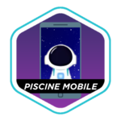

# [WIP] Programando Meu Futuro | Work in Progress

### Quick access

The **Programando Meu Futuro** (Programming My Future) is a project created by **Natura**, funded through the **Crer Para Ver** initiative, which aims to introduce children of Natura’s Beauty Consultants from low-income backgrounds to the tech job market.

The program started in 2023 in partnership with New School and continued until 2025 with 42 São Paulo. It was structured in four phases:

1. Application [mid 2023]

2. Basic Introduction to Programming with New School [late 2023 - early 2024]

3. Introduction to a Software Engineering Career Path with 42 São Paulo [mid 2024 - early 2025]

4. Work Experience at Natura’s Office (NASP) in São Paulo [mid 2025]

Each phase had its own filtering process, meaning that participants had to meet certain requirements or complete challenges to move forward. There was no fixed number of slots — whoever met the criteria progressed to the next phase.

In the first phase, around 13,000 applications were submitted. By the final phase — before the final hiring step — only 27 students remained, which represents about 0.2% of the initial applicants.

Here you’ll find my journey throughout the PMF program — enjoy exploring it!

# Start Tech | New School
> Start Tech was the introductory course I took on the New School app. It gave me my first real contact with programming and covered basic concepts using Python. Through this course, I learned how programming works in practice and how code is present in our daily lives — from sending a WhatsApp message to a friend to paying a bill online.

|  |  |
| :-: | :-: |
| Calculator | Guess a Number |

# 42 C Piscine Process
> **C Piscine** was the selection process to study at **42 São Paulo**. Before that, I had to complete a course on the New School app, participate in an online meeting where the 42 program was explained, pass some games, and get selected through an applicant draw. The Piscine was a **4-week intensive immersion** where I had to learn **Shell scripting** and **basic C programming**, interact with other candidates, and actively participate in the community. It was a great experience, but I won’t share my code here because future Pisciners need to complete the challenges on their own (if you are a pisciner, I believe in you, **trust the process**).

<table><tr><th>C Piscine</th></tr><tr><td>

| | Meeting | Games | |
| :-: | :-: | :-: | :-: |
| | Shell 00 | Shell 01 | |
| C00 | C01 | C02 | C03 |

</tr></td></tr></table>

# 42 Zip Course

> After being accepted from the Piscine, I started the **42 Zip** courses. What sets Zip apart from the **Common Core** is that we didn’t have multiple milestones — actually, there was **only one milestone** lasting **eight months** — and we had to complete **six projects** plus **one exam**. The Programming pathway consisted of the following projects: Libft, Get Next Line, So Long / FDF / Fractol, Pipex / Minitalk, Minishell, the Exam, and Mobile. _[Note: This description covers the Programming pathway only — I’m not including the Systems and Networks pathway here.]_

This was the path I followed during my time at 42:

<h2 id="reload"> Piscine Reload </h2>

Piscine Reload served as a warm-up for the upcoming courses. In this phase, I was required to rebuild several projects from the original C Piscine, but with added requirements and stricter limitations that prepared me for what was to come. A score of 50 out of 100 was needed to pass. After submitting five retries, I finally achieved 51/100 and was able to move forward.

<h2 id="libft"> Libft </h2>

Libft is a custom library of C functions I created. This project aims to recreate functions from the C standard library and implement additional ones useful for future projects. Once approved, it remains open for students to add new functions they develop throughout their journey at 42. This project helps students improve skills like problem-solving, memory management, and understanding how C works at a low level.

<h2 id="gnl"> Get Next Line </h2>

Get Next Line is a function that reads a file one line at a time. This project’s main goal is to practice buffer manipulation, memory management, and performance optimization for sequential file reading. It helped me become more comfortable working with header (.h) files and dynamic memory, and provided an introduction to how buffers and file descriptors work.

<h2 id="pipex"> Pipex </h2>

Pipex is a project that replicates the shell’s pipe process. It connects the output of one command to the input of another, allowing chained execution of processes. Through this project, I deepened my understanding of file descriptors and process execution. It was also my first project working with multiple directories which served as an introduction to software architecture.

<h2 id="so-long"> So Long </h2>

So Long is a project that challenges students to create a simple 2D game. The goal is to develop graphics skills and game logic. We used the MinilibX library, provided by 42, to render graphics and interact with the player. The game involves controlling a character, collecting items, and reaching the map’s exit. Through this project, I learned about structures in C and improved my software architecture skills.

<h2 id="minishell"> Minishell </h2>

Minishell was the most challenging project in my pathway. It involved developing a simple Unix shell. Although it was designed as a group project, I completed it independently, taking full ownership from start to finish. This project connected all the concepts I had learned in previous projects and greatly improved my software architecture and development skills. It also helped me grow soft skills such as handling pressure, resilience, and time management.

<h2 id="exam"> Zip Exam </h2>

The exam for 42 Zip was a single test, unlike the Common Core which has multiple milestones. It consisted of 10 levels (10 questions), but only required a score of 80 out of 100 to pass — while all other projects required a perfect 100. This exam also marked the moment I began to stop doubting myself and truly believe in what I had learned, since I was able to understand and develop exactly what each subject was asking for.

<h2 id="mobile"> Piscine Mobile </h2>

"Lorem ipsum dolor sit amet, consectetur adipiscing elit, sed do eiusmod tempor incididunt ut labore et dolore magna aliqua. Ut enim ad minim veniam, quis nostrud exercitation ullamco laboris nisi ut aliquip ex ea commodo consequat. Duis aute irure dolor in reprehenderit in voluptate velit esse cillum dolore eu fugiat nulla pariatur. Excepteur sint occaecat cupidatat non proident, sunt in culpa qui officia deserunt mollit anim id est laborum."

## 42 Immersions
> Lorem ipsum dolor sit amet, consectetur adipiscing elit, sed do eiusmod tempor incididunt ut labore et dolore magna aliqua. Ut enim ad minim veniam, quis nostrud exercitation ullamco laboris nisi ut aliquip ex ea commodo consequat. Duis aute irure dolor in reprehenderit in voluptate velit esse cillum dolore eu fugiat nulla pariatur. Excepteur sint occaecat cupidatat non proident, sunt in culpa qui officia deserunt mollit anim id est laborum.

<h2 id="immersion"> Python Immersion </h2>

"Lorem ipsum dolor sit amet, consectetur adipiscing elit, sed do eiusmod tempor incididunt ut labore et dolore magna aliqua. Ut enim ad minim veniam, quis nostrud exercitation ullamco laboris nisi ut aliquip ex ea commodo consequat. Duis aute irure dolor in reprehenderit in voluptate velit esse cillum dolore eu fugiat nulla pariatur. Excepteur sint occaecat cupidatat non proident, sunt in culpa qui officia deserunt mollit anim id est laborum."

# Work Place Experience
> Lorem ipsum dolor sit amet, consectetur adipiscing elit, sed do eiusmod tempor incididunt ut labore et dolore magna aliqua. Ut enim ad minim veniam, quis nostrud exercitation ullamco laboris nisi ut aliquip ex ea commodo consequat. Duis aute irure dolor in reprehenderit in voluptate velit esse cillum dolore eu fugiat nulla pariatur. Excepteur sint occaecat cupidatat non proident, sunt in culpa qui officia deserunt mollit anim id est laborum.

<h2 id="labs"> Co.Lab @ Natura </h2>

"Lorem ipsum dolor sit amet, consectetur adipiscing elit, sed do eiusmod tempor incididunt ut labore et dolore magna aliqua. Ut enim ad minim veniam, quis nostrud exercitation ullamco laboris nisi ut aliquip ex ea commodo consequat. Duis aute irure dolor in reprehenderit in voluptate velit esse cillum dolore eu fugiat nulla pariatur. Excepteur sint occaecat cupidatat non proident, sunt in culpa qui officia deserunt mollit anim id est laborum."

)

